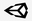

# Welcome to My Game Dev Directory!

Welcome! This is my personal game development directory. I’m **not an expert** yet—this is a space where I experiment, practice, and improve my skills across different engines and programming languages. Here you’ll find projects, prototypes, and tests as I continue learning and growing as a developer.
This directory is constantly evolving, so expect new projects and experiments as I continue to learn and grow as a developer.
# Files
This directory is organized by engine and programming language:

## Files

-  – standalone scripts and components
-  – 2D and 3D game projects
-  – scripts and prototypes
-  – full games and experiments

## Create files and folders

The file explorer is accessible using the button in left corner of the navigation bar. You can create a new file by clicking the **New file** button in the file explorer. You can also create folders by clicking the **New folder** button.
